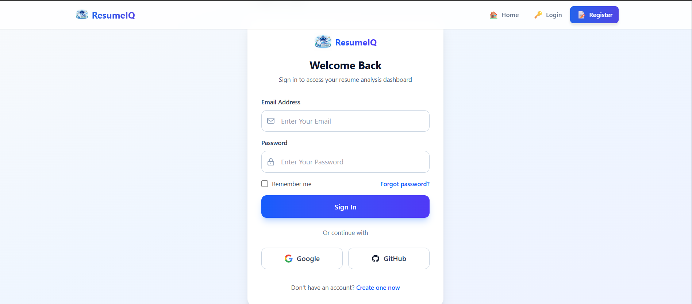
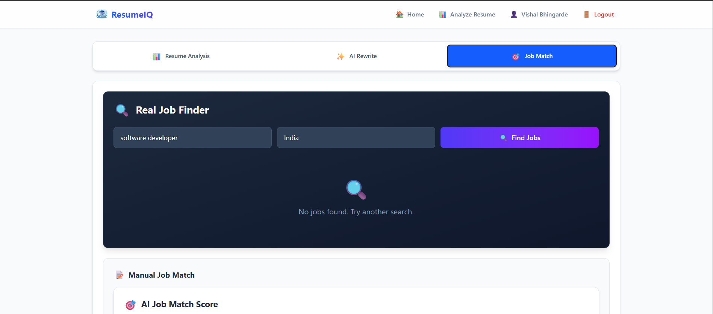
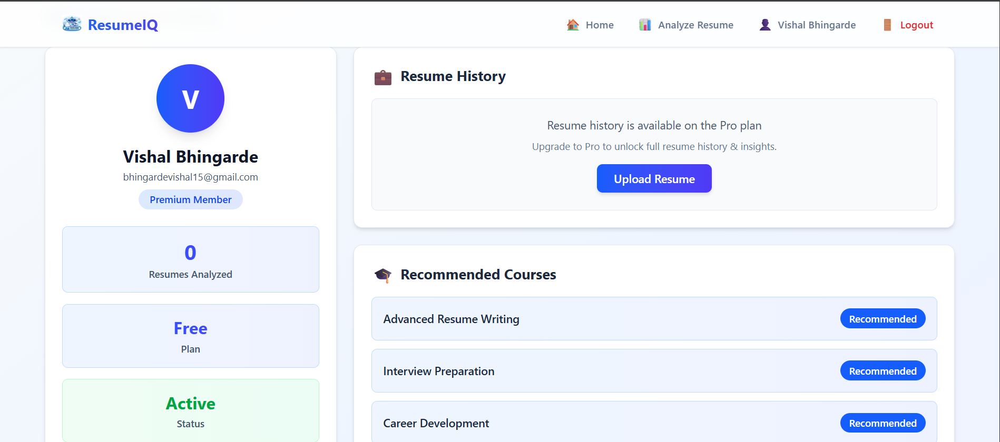
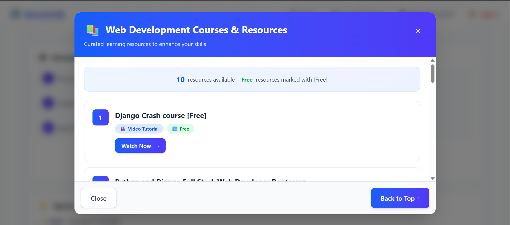

# 🤖 AI Resume Analyzer & Job Finder

A modern, AI-powered resume analysis and job-matching platform built with a full-stack architecture. The system analyzes resumes using NLP techniques, scores them against ATS-style criteria, recommends suitable roles and courses, and matches resumes with job descriptions. Designed as a production-style SaaS project to demonstrate full-stack, backend, and AI integration skills.

---

## Table of contents
- [Features](#features)
- [Demo / Screenshots](#demo--screenshots)
- [Tech stack](#tech-stack)
- [Requirements](#requirements)
- [Install & Run](#install--run)
- [Quick start](#quick-start)
- [Usage notes](#usage-notes)
- [Authentication & Security](#authentication--security)
- [Project structure](#project-structure)
- [Development](#development)
- [Future Enhancements](#future-enhancements)
- [Contributing](#contributing)
- [License & Acknowledgements](#license--acknowledgements)
- [Contact](#contact)

---

## Features
- **🔍 Resume Analysis**
  - Upload PDF resumes for AI-powered analysis
  - Extracts skills, keywords, and experience using NLP
  - Calculates an ATS-style resume score
  - Identifies candidate level (Fresher / Intermediate / Experienced)
  - Provides actionable improvement suggestions

- **🎯 Resume–Job Matching**
  - Matches resumes against job descriptions
  - Scores compatibility based on skill and keyword alignment
  - Categorizes match results (Strong / Moderate / Weak)
  - Provides role suitability insights

- **✍️ AI Resume Rewrite**
  - Rewrites resume sections for a selected target role
  - Improves clarity, relevance, and professional tone
  - Helps align resumes with job requirements

- **🎓 Course Recommendations**
  - Suggests learning resources based on missing skills
  - Personalized recommendations aligned with career goals

- **👤 User & Profile Management**
  - Secure authentication using JWT
  - OAuth login with Google and GitHub
  - User profile with resume history and analytics
  - Plan-based feature gating (Free / Pro-ready)

---

## Demo / Screenshots

Images to show:
- Home page (resume upload & features overview)
- Login / Register page (OAuth options)
- Resume analysis result dashboard
- Job matching result view
- Profile page (resume history & analytics)

## Screenshots

<div align="center">
  <table>
    <tr>
      <td>
        <a href="assets/images/homepage.png">
          
        </a>
      </td>
      <td>
        <a href="assets/images/login.png">
          
        </a>
      </td>
    </tr>
    <tr>
      <td align="center"><strong>Figure 1.</strong> Home Page Overview</td>
      <td align="center"><strong>Figure 2.</strong> Login Page</td>
    </tr>
    <tr>
      <td>
        <a href="assets/images/analysis.png">
          
        </a>
      </td>
      <td>
        <a href="assets/images/job-match.png">
          
        </a>
      </td>
    </tr>
    <tr>
      <td align="center"><strong>Figure 3.</strong> Resume Analysis Dashboard</td>
      <td align="center"><strong>Figure 4.</strong> Job Matching Results</td>
    </tr>
    <tr>
      <td>
        <a href="assets/images/profile.png">
          
        </a>
      </td>
      <td>
        <a href="assets/images/courses.png">
          
        </a>
      </td>
    </tr>
    <tr>
      <td align="center"><strong>Figure 5.</strong> User Profile & Analytics</td>
      <td align="center"><strong>Figure 6.</strong> Course Recommendations</td>
    </tr>
  </table>
</div>

---

## Tech stack
- **Frontend:** React, Tailwind CSS, Vite
- **Backend:** Python (FastAPI), JWT authentication, OAuth 2.0
- **Database:** MongoDB (local or Atlas)
- **AI / NLP:** Resume text parsing, Skill & keyword extraction, ATS-style scoring logic, Resume–job similarity matching
- **Authentication:** Google OAuth, GitHub OAuth
- **File Processing:** PDF parsing utilities
- **Visualization & UI helpers:** React components, Tailwind utilities

---

## Requirements
- Node.js 18 or higher
- Python 3.9 or higher
- MongoDB (local or Atlas)
- Internet connection required for OAuth and package installs

Install backend dependencies:
```bash
pip install -r requirements.txt
```

Install frontend dependencies:
```bash
cd frontend
npm install
```

---

## Install & Run

1. Clone the repository:
```bash
git clone https://github.com/your-username/ai-resume-analyzer.git
cd ai-resume-analyzer
```

2. Backend setup:

   a. Create and activate a virtual environment:
   ```bash
   # macOS / Linux
   python3 -m venv venv
   source venv/bin/activate

   # Windows PowerShell
   python -m venv venv
   venv\Scripts\Activate.ps1
   ```

   b. Install dependencies:
   ```bash
   pip install -r requirements.txt
   ```

   c. Create a `.env` file in the backend directory:
   ```bash
   MONGODB_URI=mongodb://localhost:27017/resume_analyzer
   JWT_SECRET=your_jwt_secret_key_here
   GOOGLE_CLIENT_ID=your_google_client_id
   GOOGLE_CLIENT_SECRET=your_google_client_secret
   GITHUB_CLIENT_ID=your_github_client_id
   GITHUB_CLIENT_SECRET=your_github_client_secret
   ```

   d. Run the backend server:
   ```bash
   uvicorn main:app --reload
   ```
   Backend will be available at http://localhost:8000

3. Frontend setup:
```bash
cd frontend
npm install
npm run dev
```
Frontend will be available at http://localhost:5173

---

## Quick start
- Register a new account or sign in using Google/GitHub OAuth.
- Upload a PDF resume from the dashboard.
- View your ATS score, extracted skills, and improvement suggestions.
- Paste a job description to see how well your resume matches.
- Explore recommended courses based on identified skill gaps.
- Access your resume history and analytics from your profile page.
- Use the AI rewrite feature to optimize your resume for specific roles.

---

## Usage notes
- Only PDF format is supported for resume uploads.
- Resume history and advanced analytics features may be plan-gated (Free vs Pro).
- OAuth users (Google/GitHub) share the same identity model as email/password users.
- All AI processing happens server-side to ensure consistency and security.
- Session state is managed via JWT tokens — logging out clears authentication.
- The platform is designed for individual use and can be extended for enterprise deployment.

---

## Authentication & Security

1. **JWT Authentication**
   - Secure token-based authentication for API access
   - Tokens expire after configured duration for security
   - Refresh token mechanism for seamless user experience

2. **OAuth 2.0 Integration**
   - Google OAuth for quick sign-in
   - GitHub OAuth for developer-friendly authentication
   - Unified email-based user identity across all authentication methods
   - Secure callback handling and token exchange

3. **Password Security**
   - Passwords are hashed using industry-standard algorithms before storage
   - Never store plain-text passwords
   - Secure password reset flow

4. **Environment Variables**
   - All sensitive credentials stored in `.env` file
   - Never commit `.env` to source control
   - Use environment-specific configuration for production deployment

5. **API Security**
   - Protected endpoints require valid JWT tokens
   - Rate limiting on authentication endpoints
   - Input validation and sanitization on all user inputs

---

## Project structure
(high level — adjust if files change)
```
ai-resume-analyzer/
├── backend/
│   ├── main.py               # FastAPI application entry point
│   ├── database.py           # MongoDB connection & setup
│   ├── models.py             # Pydantic data models & schemas
│   ├── users.py              # User management & auth routes
│   ├── oauth.py              # Google & GitHub OAuth handlers
│   ├── resume.py             # Resume upload & analysis APIs
│   ├── analyzer.py           # ATS scoring & NLP logic
│   ├── job_match.py          # Resume–job matching algorithms
│   ├── courses_api.py        # Course recommendation engine
│   ├── requirements.txt      # Python dependencies
│   └── .env                  # Environment variables (not committed)
│
├── frontend/
│   ├── src/
│   │   ├── components/       # Reusable React components
│   │   ├── api/              # API integration utilities
│   │   ├── App.jsx           # Main application component
│   │   └── main.jsx          # Application entry point
│   ├── public/               # Static assets
│   ├── package.json          # Node dependencies
│   └── vite.config.js        # Vite configuration
│
├── assets/
│   └── images/               # Screenshots & branding assets
│
├── .gitignore
├── requirements.txt          # Backend dependencies
└── README.md                 # This file
```

Files of interest:
- `analyzer.py` — Core NLP logic, skill extraction, ATS scoring
- `job_match.py` — Resume-to-job compatibility algorithms
- `oauth.py` — OAuth flow implementation for Google & GitHub
- `users.py` — Authentication, registration, and profile management
- `courses_api.py` — Personalized learning recommendations

---

## Development
- Recommended workflow:
  1. Fork and create a feature branch: `git checkout -b feature/your-feature`
  2. Implement and test locally (backend + frontend)
  3. Write tests for new features where appropriate
  4. Open a pull request with clear description and testing steps
- Modular frontend component design for reusability
- Clean separation of concerns in backend services
- Error handling and validation implemented across all APIs
- Designed to be extensible for future SaaS features
- Keep sensitive credentials (OAuth keys, JWT secrets) in `.env` and out of version control

---

## Future Enhancements
- Payment integration for Pro subscription plans
- Advanced analytics dashboard with insights and trends
- Real-time job listings integration from major job boards
- Multi-resume comparison feature
- Admin panel for user insights and platform analytics
- Resume templates and customization options
- Interview preparation resources based on job matches
- Mobile application (React Native)
- AI-powered interview question generation
- Resume version control and history tracking

---

## Contributing
Contributions are welcome! Here's how you can help:

1. Fork the repository
2. Create a feature branch:
```bash
git checkout -b feature/my-feature
```
3. Commit your changes with clear, descriptive messages
4. Push to your fork and open a pull request
5. Describe your changes and provide testing instructions in the PR description

Please open an issue to discuss larger changes before implementing them.

**Areas where contributions are especially welcome:**
- Additional NLP models for resume parsing
- UI/UX improvements
- Testing and bug fixes
- Documentation improvements
- New feature ideas

---

## License & Acknowledgements
- This project is provided for personal and educational use.
- Acknowledgements:
  - **React** — Frontend framework
  - **FastAPI** — Backend API framework
  - **Tailwind CSS** — Utility-first CSS framework
  - **MongoDB** — Database solution
  - **PyMongo** — MongoDB driver for Python
  - **JWT** — Secure authentication tokens
  - **Google & GitHub OAuth** — Social authentication
  - **NLP libraries** — Resume parsing and analysis
  - **Vite** — Frontend build tool

---

## Contact
Created by **Vishal Bhingarde**

Final-year Computer Science student focused on full-stack development, backend systems, and AI-driven applications.

For questions, feature requests, feedback, or collaboration opportunities:
- Open an issue in this repository
- Submit a pull request

- 📬 Contact Me on 

- 📧 Email: bhingardevishal5@gmail.com

- 💼 LinkedIn: www.linkedin.com/in/vishal-bhingarde-bb23a2376

- 🐙 GitHub: [github.com/ ](https://github.com/Vishal710-max)

---

**⭐ If you find this project helpful, please consider giving it a star!**
